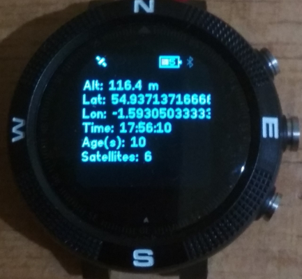
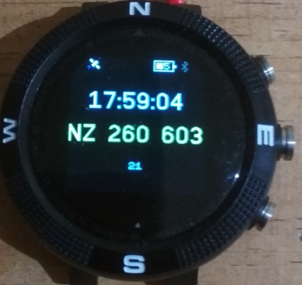

# GPS Service

A configurable, low power GPS widget that runs in the background.

## Goals

To develop a low power GPS widget that runs in the background and to
facilitate an OS grid reference display in a watch face.

* An app that turns on the GPS and constantly displays the screen
  will use around 75mA, the battery will last between 3-4 hours.

* Using the GPS in a Widget in Super-E Power Saving Mode (PSM) with
  the screen off most of the time, will consume around 35mA and you
  might get 10hrs before a recharge.
  
* Using the GPS in Power Saving Mode On/Off (PSMOO) with suitable
  settings can reduce the average consumption to around 15mA.  A
  simple test using a 120s update period, 6s search period was still
  running with 45% battery 20 hours after it started.

## Settings

The Settings App enables you set the following options for the GPS
Service.  Go to Settings, select App/Widgets and then 'GPS Service'.

* GPS - On/Off.  When this value is changed the GPS Service will be
  powered on or off and the GPS Widget will be displayed.

* Power Mode:

** Super-E - the factory default setup for the GPS. The
   recommended power saving mode.

** PSMOO - On/Off power saving mode. Configured by interval and
   search time. Choose this mode if you are happy to get a GPS
   position update less often (say every 1 or 2 minutes). The longer
   the interval the more time the GPS will spend sleeping in low
   power mode (7mA) between obtaining fixes (35mA).  For walking in
   open country an update once every 60 seconds is adequate to put
   you within a 6 digit grid refernce sqaure.
   

## Screenshots
* GPS Watch face

* Grid Reference Watch face

## To Do List
* add a logging option with options for interval between log points
* add graphics and icons to the watch faces to make them look nicer

## References
* data sheet
* power saving PDF
* other code

