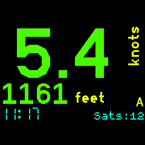
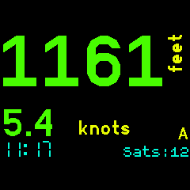
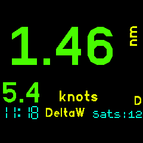
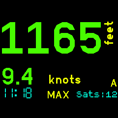

Displays the GPS speed, altitude and distance to selected waypoint. One is displayed on the watch face using the largest possible characters depending on the number of digits. The other is in a smaller characters below that. Both are always visible. You can display the current or maximum observed speed/altitude values. Current time is always displayed. 

You can chose between two modes. One showing speed and altitude and one showing speed and distance to waypoint. 

The waypoints list is the same as that used with the [GPS Navigation] app so the same set of waypoints can be used across both apps. Refer to that app for waypoint file information.

Left Display Tap : Swaps the displays. You can have either speed or altitude/distance on the large primary display.

Right Display Tap : Swaps the modes between Speed+Altitude or Speed+Distance Note: You cannot swap to Speed+Distance while displaying MAX values.

BTN1 : Short press < 2 secs toggles the displays between showing the current speed/alt values or the maximum speed/alt values recorded.

BTN1 : Long press > 2 secs resets the recorded maximum values.

BTN3 : (Only in Speed+Distance mode) Select waypoint. Last fix distance from selected waypoint is displayed.

App Settings : Select the desired display units. Speed can be as per the default locale, kph, knots, mph or m/s. Distance caqn be km, miles or nautical miles. Altitude can be feet or metres. Select one of three colour schemes. Colours, high contrast (all white on black) or night ( all red on black ). Vibration can be used to indicate when a fix is lost or gained. One buzz for a lost fix and a double buzz when a fix is found.

Speed and Altitude: 

Left tap swaps displays: 

Distance to waypoint DeltaW: 

MAX Values instead: 

Settings: 

Developed for my use in sailing, cycling and motorcycling. If you find this software useful or have feedback drop me a line mike[at]kereru.com. Enjoy!

Thanks:
Many thanks to Gordon Williams. Awesome job.
Also to @jeffmer, the developer of the 'GPS Navigation' app. 

Waypoints:

Create a file waypoints.json and write to storage on the Bangle.js using the IDE.

Sample waypoints.json

<pre>
[
  {
  "name":"NONE"
  },
  {
  "name":"Omori",
  "lat":-38.9058670,
  "lon":175.7613350
  },
  {
  "name":"DeltaW",
  "lat":-38.9438550,
  "lon":175.7676930
  },
  {
  "name":"DeltaE",
  "lat":-38.9395240,
  "lon":175.7814420
  },
  {
  "name":"BtClub",
  "lat":-38.9446020,
  "lon":175.8475720
  },
  {
  "name":"Hapua",
  "lat":-38.8177750,
  "lon":175.8088720
  },
  {
  "name":"Nook",
  "lat":-38.7848090,
  "lon":175.7839440
  },
  {
  "name":"ChryBy",
  "lat":-38.7975050,
  "lon":175.7551960
  },
  {
  "name":"Waiha",
  "lat":-38.7219630,
  "lon":175.7481520
  },
  {
  "name":"KwaKwa",
  "lat":-38.6632310,
  "lon":175.8670320
  },
  {
  "name":"Hatepe",
  "lat":-38.8547420,
  "lon":176.0089124
  },
  {
  "name":"Kinloc",
  "lat":-38.6614442,
  "lon":175.9161607
  }
]
</pre>
